# Software Design Document (SDD)
## PharmaAssist — AI-Augmented Point-of-Sale, Inventory and Analytics System for Retail Pharmacy

Document version: 0.2  
SRS baseline: PharmaAssist SRS v2.2

---

### 1. System Architecture & Logical Boundaries

PharmaAssist is engineered as a mobile-first, offline-capable Progressive Web Application (PWA) with a single authoritative database backend.

```mermaid
flowchart TD
    subgraph Presentation_Layer["Presentation Layer (Dark Navy #0a0f1d)"]
        UI_POS["CounterPOS.tsx (Touch-Optimized)"]
        UI_SCAN["BarcodeScannerModal.tsx (Smart OCR & Barcode)"]
        UI_INS["InsightsScreen.tsx (Sparklines & Deep-Linked Alerts)"]
        UI_INV["InventoryScreen.tsx (Reason-Coded Adjustments)"]
        UI_PROC["ProcurementScreen.tsx (On-Order Deduplication)"]
    end

    subgraph Application_Domain_Services["Application & Domain Services (Pure TypeScript)"]
        SVC_OCR["SmartScanService (Regex Heuristics & Matcher)"]
        SVC_FCS["TimeSeriesForecastService (Holt-Winters / ETS & MAPE)"]
        SVC_CRS["CrossSellService (Conditional Probability P(B|A))"]
        SVC_PROC["ProcurementService (Priority Scoring & On-Order Deduplication)"]
        SVC_ALT["InventoryAlertService (Actionable Deep Links)"]
        SVC_SAFE["SafetyCheckService (Deterministic Clinical Reference)"]
        SVC_PRICE["PricingDiscountService (Ceiling Check & Leakage)"]
        SVC_SYNC["OfflineSyncService (Queue Reconciliation)"]
    end

    subgraph Data_Layer["Persistence Layer"]
        DB_ONLINE["Supabase PostgreSQL (RLS & dispatch_transaction_v2 RPC)"]
        DB_OFFLINE["IndexedDB / LocalStorageAdapter (Offline Shell Cache)"]
    end

    UI_POS --> SVC_SAFE
    UI_POS --> SVC_PRICE
    UI_POS --> SVC_CRS
    UI_POS --> UI_SCAN
    UI_SCAN --> SVC_OCR
    UI_INS --> SVC_FCS
    UI_INS --> SVC_ALT
    UI_PROC --> SVC_PROC
    SVC_PROC --> SVC_FCS

    SVC_SAFE --> DB_ONLINE
    SVC_SAFE --> DB_OFFLINE
    SVC_PRICE --> DB_ONLINE
    SVC_PRICE --> DB_OFFLINE
    SVC_SYNC --> DB_ONLINE
```

---

### 2. Domain Decomposition & Key Services

#### 2.1 Smart OCR Package Scanner (`SmartScanService`)
- Normalizes raw text from camera capture, OCR image pipelines, or keyboard-wedge scanners.
- Parses batch number (`B.No.`, `BATCH`, `LOT`), expiry date (`EXP MM/YY` or `MM/YYYY`), manufacturing date (`MFG`), strength (e.g., `650mg`, `500mg+125mg`), dosage form (`Tablet`, `Capsule`, `Syrup`), and barcodes (`EAN-13`, `GTIN`).
- Matches extracted tokens against `DrugMaster` and `StockBatch` with a multi-factor confidence score.
- Enforces human-in-the-loop review before dispatch (`CON-04`, `CON-05`).

#### 2.2 Time-Series Forecasting (`TimeSeriesForecastService`)
- Builds continuous, zero-padded daily sales arrays across 7-day and 14-day horizons.
- Applies double exponential smoothing (Holt-Winters / ETS) modeling level $\alpha=0.3$ and trend $\beta=0.1$.
- Computes rolling backtest Mean Absolute Percentage Error (MAPE) against historical test windows (`NFR-REL-01`).
- Enforces cold-start fallback to configured reorder thresholds when history is fewer than 30 days (`BR-05 -> BR-01`).
- Segments projections by visit type (`OTC` vs `Prescription`) and indication category.

#### 2.3 Predictive Cross-Selling (`CrossSellService`)
- Evaluates co-occurrence pairs with conditional probability $P(B|A) = \frac{\text{Count}(A \cap B)}{\text{Count}(A)}$.
- Factors in recency weighting and indication affinity.
- Filters out candidates with zero stock on hand.
- Produces natural-language clinical rationales for operator transparency.

#### 2.4 Procurement & Inventory Intelligence (`ProcurementService` & `InventoryAlertService`)
- Calculates net required stock:
  $$\text{Net Required} = (\text{Threshold} + \text{Forecast} + \text{Unmet Demand}) - (\text{Stock on Hand} + \text{On-Order Stock})$$
- Deduplicates pending quantities from drafted, sent, and confirmed purchase orders.
- Generates actionable, deep-linked alerts routing operators to `procurement` (for stockouts) and `inventory` (for expiry write-offs).

---

### 3. Database Schema & RPC Functions

#### 3.1 Migration `20260928010000_pharmaassist_smart_scan_forecasting.sql`
- **Tables extended:**
  - `drug_master`: Added `indication_category` and barcode identifier arrays.
  - `transaction_item`: Added `indication_category`.
  - `unmet_demand`: Added `indication_category`.
  - `supplier_quality_event`: Records real delivery on-time status, quantity discrepancies, and quality inspection flags.
  - `cross_sell_event`: Records co-occurrence events with conditional probabilities.
  - `demand_forecast`: Records time-series projections, backtest MAPE, and model versions.
- **RPC Function `dispatch_transaction_v2`:**
  - Executes stock validation, stock decrement, transaction creation, item insertion, and leakage flagging in a single atomic database transaction.
  - Supports indication categorization and client-side optimistic stock version checking.

---

### 4. Non-Negotiable Invariants
1. **Single Authoritative Stock Ledger:** Only dispatch, purchase receipt, and explicit reason-coded adjustments may mutate stock (`FR-INV-01`).
2. **Atomic Dispatch:** Stock decrement and transaction logging commit atomically (`FR-POS-06`).
3. **Safety Separation:** Deterministic reference contraindication checks remain separate from advisory recommendations (`CON-04`, `NFR-SAFE-01`).
4. **No Payment Processing:** Monetary transaction values recorded only (`CON-06`).
5. **Single-Operator Scope:** Strict single-user workflow (`CON-05`).
