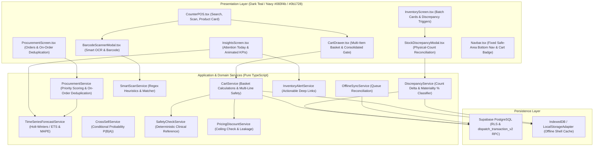

# Software Design Document (SDD)
## PharmaAssist — AI-Augmented Point-of-Sale, Inventory and Analytics System for Retail Pharmacy

Document version: 0.3  
SRS baseline: PharmaAssist SRS v2.3

---

### 1. System Architecture & Logical Boundaries

PharmaAssist is engineered as a mobile-first, offline-capable Progressive Web Application (PWA) with a single authoritative database backend.

---

### 2. Domain Decomposition & Key Services

#### 2.1 Commercial-Style POS Cart (`CartService`)
- Manages `CartItem` state representing staged medication lines for a single customer.
- Evaluates line pricing, subtotal, total discount, and grand total in `₹`.
- Aggregates safety checks across all cart items. Disallows dispatch if any line has an unresolved clinical conflict or unverified prescription.
- Final dispatch calls authoritative atomic dispatch (`dispatch_transaction_v2` / `atomicLocalDispatch`). Adding items to the cart never mutates stock.

#### 2.2 Physical-Count Stock Discrepancy (`DiscrepancyService`)
- Compares physical count with system quantity: $\text{Delta} = \text{Physical} - \text{System}$.
- Classifies materiality:
  - $\text{None} = 0\%$
  - $\text{Minor} \le 5\%$
  - $\text{Material} \le 10\%$
  - $\text{Significant} > 10\%$
- Validates mandatory reason code and requires audit notes for significant discrepancies or reason `other`.
- Reconciles through authoritative stock adjustment service/RPC (`apply_stock_adjustment`).

#### 2.3 Motion & Animation Architecture (`AnimatedNumber` & Tokens)
- Centralized semantic design tokens in `index.css`:
  - `--pa-bg: #083f4b`
  - `--pa-surface: #0b1728`
  - `--pa-surface-raised: #102236`
  - `--pa-border: #23455b`
  - `--pa-primary: #19a9ff`
  - `--pa-success: #21c77a`
  - `--pa-warning: #f2b51d`
  - `--pa-danger: #d9364f`
- Cubic-out numerical interpolation (`AnimatedNumber`) over 300–400ms for KPIs, cart quantities, and totals.
- Reduced-motion mode (`@media (prefers-reduced-motion: reduce)`) gracefully bypasses animation duration to avoid cognitive strain.

#### 2.4 Pharmaceutical Tax Invoice Generator & Live Counter Stock Architecture
- **Invoice Presentation Layer (`InvoiceGeneratorModal`):**
  - Displays printable, compliant Indian retail pharmaceutical tax invoice immediately following single dispatch or consolidated cart checkout.
  - Automatically computes taxable base, CGST (6%), SGST (6%), and converts net payable to words (`numberToWordsINR`).
  - Supports dual formats: Retail Tax Invoice (A4 / Half-Page) with DL number, GSTIN, and Pharmacist signature stamp, and ESC/POS thermal slip (80mm).
- **Counter Live Stock Display (`CounterPOS`):**
  - Aggregates multi-batch quantities per drug, rendering live stock pills (`In Stock`, `Low Stock`, `Out of Stock`).
  - Displays live capacity meters and remaining post-dispense stock forecasts during quantity selection.
  - Provides quick dispensary catalog grid for instant selection and stock visibility when search input is empty.

---

### 3. Database Schema & RPC Functions

#### 3.1 Migration `20260928010000_pharmaassist_smart_scan_forecasting.sql`
- **Tables extended:**
  - `drug_master`: Added `indication_category` and barcode identifier arrays.
  - `transaction_item`: Added `indication_category`.
  - `unmet_demand`: Added `indication_category`.
  - `supplier_quality_event`: Records real delivery on-time status, quantity discrepancies, and quality inspection flags.
  - `cross_sell_event`: Records co-occurrence events with conditional probabilities.
  - `demand_forecast`: Records time-series projections, backtest MAPE, and model versions.
- **Stored Procedure `dispatch_transaction_v2`:**
  - Atomic stock validation, stock decrement, transaction creation, item insertion, and leakage flagging in a single database transaction.

---

### 4. Non-Negotiable Invariants
1. **Single Authoritative Stock Ledger:** Only dispatch, purchase receipt, and explicit reason-coded adjustments may mutate stock (`FR-INV-01`).
2. **Atomic Dispatch:** Stock decrement and transaction logging commit atomically (`FR-POS-06`).
3. **Safety Separation:** Deterministic reference contraindication checks remain separate from advisory recommendations (`CON-04`, `NFR-SAFE-01`).
4. **No Payment Processing:** Monetary transaction values recorded only (`CON-06`).
5. **Single-Operator Scope:** Strict single-user workflow (`CON-05`).
